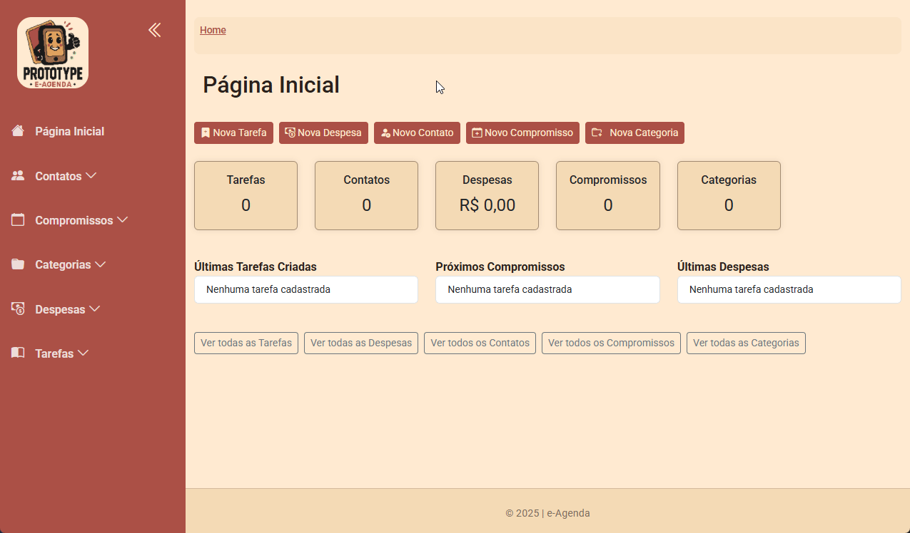

# 🎥 Demonstração Visual

Abaixo estão exemplos visuais da aplicação eAgenda em funcionamento:

---

## 🏠 Página Inicial

---

## ✅ Cadastro e Gerenciamento de Tarefas

### Criar Tarefa

### Visualizar Tarefas

### Adicionar & Concluir Itens

### Tarefas com Itens

---

## 💸 Módulo de Despesas

### Cadastro

### Visualização

---

## 📞 Módulo de Contatos

### Cadastro

---

> 🔗 Voltar ao [README](../../README.md)